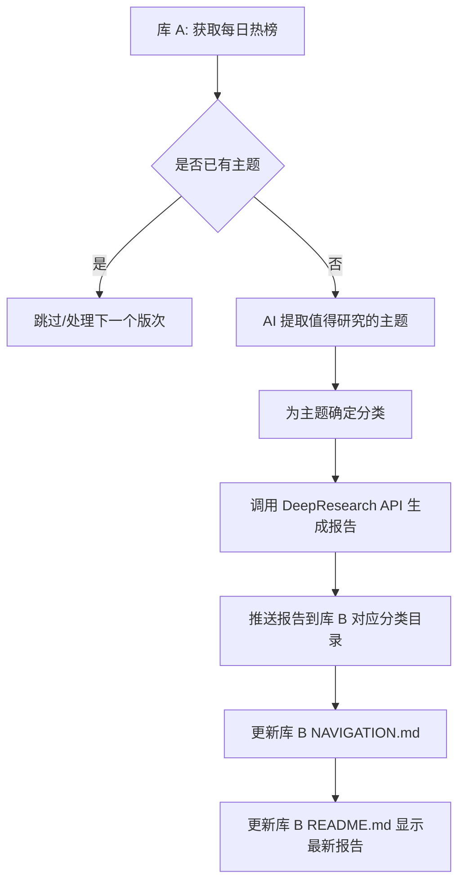

# 每日 DeepResearch 自动化方案（库 A → 库 B）

本文档描述库 A 负责“热榜抓取 + 主题生成 + 报告生成 + 推送/更新库 B 导航与 README”，库 B 仅负责“存储报告与展示”。

## 目标
- 每天基于 Google 热榜自动生成深度研究主题
- 在库 B 生成并存储结构化 Markdown 报告
- 自动更新库 B 导航（NAVIGATION.md）与首页（README.md）

---

## 总体流程



---

## 模块拆解与职责

| 模块 | 主要职责 | 建议技术/库 | 关键输出/副作用 |
|---|---|---|---|
| 热榜抓取 | 获取每日 Google 热榜 | requests + BeautifulSoup 或 Google Trends API | 当日热榜 JSON |
| 历史比对 | 判断版次是否已生成主题，去重 | JSON/SQLite；哈希指纹去重 | 去重后的候选主题集 |
| 主题提取 | 借助 AI 提取“可研究”的主题 | DeepResearch 官方库/API | 主题 + 分类（含置信度） |
| 报告生成 | 深度研究并生成报告 Markdown | DeepResearch API（流式或分步） | 报告 .md 文本 |
| 存储与推送 | 写入库 B 对应分类目录并提交 | GitHub API 或 git push（PAT） | 新增/更新文件 + commit |
| 导航更新 | 生成/更新 NAVIGATION.md | Python 脚本（幂等） | 可折叠分类 + 链接列表 |
| README 更新 | 首页展示最新报告 | 模板拼接 + 渲染占位符 | 最新 N 篇报告摘要 |
| 自动化执行 | 定时与编排 | GitHub Actions + cron | 每日自动运行、失败重试 |

---

## DeepResearch API 的实现
调用库gemini-fullstack-langgraph-quickstart的后端，使用python调用api实现DeepResearch

---

## 库 B 文件结构建议

```
DeepResearch-Archive/
├─ README.md
├─ NAVIGATION.md            # 由库 A 自动更新（幂等）
├─ AI_Reports/
│  ├─ 分类A/
│  │  ├─ 主题A-2025-08-20--v1.md
│  │  └─ 主题B-2025-08-19--v2.md
│  ├─ 分类B/
│  │  └─ ...
│  └─ ...
└─ history.json             # 可选：冪等/追踪生成记录
```

命名规范：
- 文件名：{slugified_主题}-{日期}--v{版次}.md（避免空格/特殊字符；统一 UTF-8）
- 分类目录：使用安全目录名（slug 化），与导航展示名分离（存显示名映射）

---

## 报告 Markdown 模板

```
版次: 头版（v1）
日期: 2025-08-20
主题: AI 本地小模型优化

来源: https://trends.google.com/...

# 摘要
- 核心发现/要点（3-5 条）

# 背景
- 背景信息与跨源验证

# 深度分析
- 论点 1
- 论点 2
- 论点 3

# 数据与引用
- [来源 1](...)
- [来源 2](...)

# 结论与建议
- 结论与可执行建议
```

---

## NAVIGATION.md 结构（建议）

- 顶部：标题 + 目录
- 各分类按“最近日期优先”，每类显示最近 N（例如 20）条，更多折叠
- 每条：标题（含日期）+ 版次 + 来源链接

示例（片段）：
```
# DeepResearch 报告导航

## 分类A
- [AI 本地小模型优化 - 2025-08-20](AI_Reports/分类A/ai-ben-di-xiao-mo-xing-you-hua-2025-08-20--v1.md) (v1) [来源](https://trends.google.com/...)
- [主题B - 2025-08-19](AI_Reports/分类A/zhu-ti-b-2025-08-19--v2.md) (v2) [来源](...)

## 分类B
- [...]
```

---

## 数据存储与幂等策略

库 A：
- daily_trends/{yyyy-mm-dd}.json：当日热榜原始数据（缓存）
- state/history.json：已生成记录（键：主题哈希/日期/版次）+ 状态机（pending/ok/failed）
- 去重策略：以主题归一化文本 + 日期 + 版次生成 SHA-256 指纹；遇到重复则跳过

库 B：
- 仅存最终报告与导航
- history.json（可选）：记录报告元数据（slug、显示名、分类、日期、来源、版次、路径）

幂等原则：
- 重跑同日同主题同版次 → 不重复生成
- 导航/README 基于扫描 + 模板渲染生成（纯函数），避免“累积错误”
- 推送前先对比 diff，空变化不提交（减少无意义 commit）

---

## 关键流程伪代码（库 A）

```
load_config()
today_trends = fetch_trends_cached(date=today)
candidates = extract_candidates_via_ai(today_trends)

for topic in candidates:
    if is_duplicate(topic, date=today, edition=topic.edition):
        continue

    category = classify_topic(topic)
    report_md = deepresearch_generate_markdown(topic, category)

    path = repoB_path_for(category, topic, date=today, edition=topic.edition)
    write_or_update_file_in_repoB(path, report_md)

    update_repoB_navigation()
    update_repoB_readme()

    record_history(topic, date=today, edition=topic.edition, status="ok")
```

---

## GitHub Actions（库 A）优化版

```yaml
name: Daily DeepResearch

on:
  schedule:
    - cron: '0 16 * * *'  # 北京时间每日 00:00 运行（UTC+8 → UTC-8 差 16h）
  workflow_dispatch:

permissions:
  contents: write    # 允许推送到仓库
  actions: read

concurrency:
  group: daily-deepresearch
  cancel-in-progress: false

jobs:
  generate_report:
    runs-on: ubuntu-latest

    steps:
      - uses: actions/checkout@v4
        with:
          fetch-depth: 0

      - name: Setup Python
        uses: actions/setup-python@v5
        with:
          python-version: '3.11'

      - name: Cache pip
        uses: actions/cache@v4
        with:
          path: ~/.cache/pip
          key: pip-${{ runner.os }}-${{ hashFiles('**/requirements.txt') }}
          restore-keys: |
            pip-${{ runner.os }}-

      - name: Install dependencies
        run: pip install -r requirements.txt

      - name: Configure git user
        run: |
          git config user.name "github-actions[bot]"
          git config user.email "41898282+github-actions[bot]@users.noreply.github.com"

      - name: Run daily workflow
        env:
          GH_TOKEN: ${{ secrets.REPO_B_TOKEN }} # 限权 PAT，用于写入库 B
          REPO_B:  owner/DeepResearch-Archive
          TZ: Asia/Shanghai
        run: |
          python main_workflow.py
```

建议：
- 使用最小权限 PAT（仅 repo:contents 权限）作为 secrets.REPO_B_TOKEN
- 通过 GitHub API/Contents 或 sparse checkout 提交到库 B，避免把库 B 当子模块
- 设置 timezone 环境变量，保障日期一致性

---

## 性能优化要点

- 缓存热榜：优先读缓存文件，减少外部请求；设定短期失效（如 24h）
- 批量提交：同一运行中聚合多个文件变更后一次性提交到库 B
- 只写有变更的文件：构建内容哈希，未变化则跳过写入与提交
- 导航/README 增量更新：扫描文件系统构建索引；渲染使用模板 + 局部排序
- 并发生成报告：对多个主题使用异步或线程池（注意 API 速率限制与重试策略）

---

## 错误处理与边界情况

- 外部 API 失败/超时：指数退避重试（如 3/5/9 秒），超过重试记录失败并跳过
- 当日无有效主题：优雅退出，输出“今日无新增”，不提交空变更
- 重复主题/命名冲突：通过指纹去重 + 版本后缀（--vN）解决
- 分类缺失/置信度低：归入“未分类/Uncategorized”，并记录待人工回顾标签
- 编码与路径安全：统一 UTF-8；文件名/目录名 slug 化；保留显示名映射
- Git 冲突：拉取更新后重试一次提交；若仍失败，记录为“需要人工干预”
- 速率限制：捕获 429/403，读取响应头速率信息，延迟后重试
- 内容审查：对生成报告进行敏感词/URL 白名单过滤，避免注入不可信链接

---

## 配置与可观测性

- 配置优先级：环境变量 > .env > 默认值；敏感信息仅存 Secrets
- 日志：结构化日志（jsonl），级别 INFO/ERROR；关键事件（生成/提交）需打点
- 追踪：为每次运行生成 run_id；在 history.json 中记录每条主题的 run_id 与状态
- 告警：失败率超过阈值或连续失败 N 次时触发通知（如 issue 或钉钉/飞书 Webhook）

---

## 总结
- 库 A：全流程编排（抓取 → 生成 → 存储 → 更新导航/README），对外部依赖提供重试与幂等保障
- 库 B：只负责“可消费的内容与展示”，可随时被重建导航而不丢数据
- 通过缓存、幂等、增量生成与最小权限原则实现低维护、可恢复与可扩展