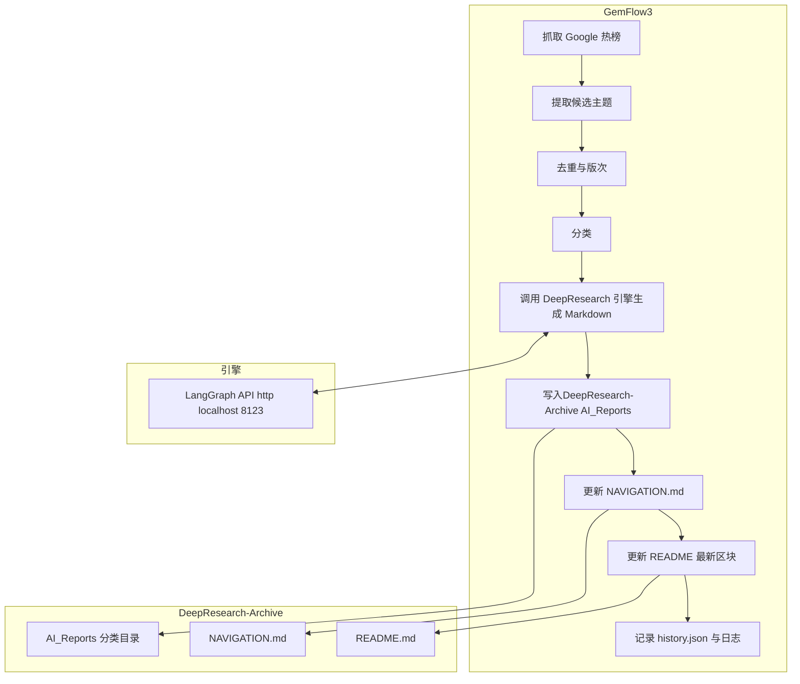

# Gemflow3 — 每日 DeepResearch 自动化（GemFlow3 → DeepResearch-Archive）+ LangGraph 引擎

本仓库集成了“GemFlow3 编排 + DeepResearch-Archive 内容归档展示 + LangGraph DeepResearch 引擎”一体化方案，实现每日自动抓取热点、生成结构化 Markdown 报告、推送到DeepResearch-Archive，并自动更新 NAVIGATION.md 与 README 最新报告区块。

- 编排侧 Gemflow3: Python 工作流，负责抓取→候选生成→分类→调用引擎→落DeepResearch-Archive→更新导航与首页→幂等记录
- 引擎侧: 使用 Google Gemini + LangGraph 的研究代理，通过 web 搜索与反思迭代完成深入研究并产出可引用的回答
- 运行形态: GitHub Actions 内部基于 docker-compose 拉起引擎 http://localhost:8123 ，然后执行GemFlow3 主流程

相关背景文档可见 [Code-Map.md](Code-Map.md)。

---

## 目录结构

- GemFlow3（编排与自动化）
  - 主流程入口: [Flow/main_workflow.py](Flow/main_workflow.py)
  - 依赖清单: [Flow/requirements.txt](Flow/requirements.txt)
  - 环境样例: [Flow/.env.example](Flow/.env.example)
  - 配置加载: [Flow/src/config.py](Flow/src/config.py)
  - 引擎客户端: [Flow/src/engine_client.py](Flow/src/engine_client.py)
  - 热榜抓取与缓存: [Flow/src/trends.py](Flow/src/trends.py)
  - 主题提取与分类: [Flow/src/topics.py](Flow/src/topics.py)
  - 历史与幂等: [Flow/src/history.py](Flow/src/history.py)
  - GitHub API 写入: [Flow/src/github_api.py](Flow/src/github_api.py)
  - 导航与 README 渲染: [Flow/src/renderers.py](Flow/src/renderers.py)
  - 工具函数: [Flow/src/utils.py](Flow/src/utils.py)
  - 结构化日志: [Flow/src/logger.py](Flow/src/logger.py)
- 引擎（LangGraph + Gemini）
  - 总览与使用: [gemini-fullstack-langgraph-quickstart/README.md](gemini-fullstack-langgraph-quickstart/README.md)
  - 后端图定义: [gemini-fullstack-langgraph-quickstart/backend/src/agent/graph.py](gemini-fullstack-langgraph-quickstart/backend/src/agent/graph.py)
  - FastAPI 前端挂载: [gemini-fullstack-langgraph-quickstart/backend/src/agent/app.py](gemini-fullstack-langgraph-quickstart/backend/src/agent/app.py)
  - 容器构建: [gemini-fullstack-langgraph-quickstart/Dockerfile](gemini-fullstack-langgraph-quickstart/Dockerfile)
  - 运行编排（CI 内部）: [gemini-fullstack-langgraph-quickstart/docker-compose.yml](gemini-fullstack-langgraph-quickstart/docker-compose.yml)
- CI 工作流
  - 每日任务: [.github/workflows/daily-deepresearch.yml](.github/workflows/daily-deepresearch.yml)

---

## 架构与流程



报告命名: {slugified_主题}-{日期}--v{版次}.md  
示例路径: AI_Reports/<分类slug>/ai-ben-di-xiao-mo-xing-you-hua-2025-08-20--v1.md

---

## 快速开始

### 方式 A：本地 dry-run（不推送DeepResearch-Archive，仅验证流程）

1) 安装依赖
```bash
pip install -r Flow/requirements.txt
```

2) 配置环境
复制 [Flow/.env.example](Flow/.env.example) 为 .env 并按需修改。例如:
```
REPO_B=owner/DeepResearch-Archive
DEEPRESEARCH_BASE_URL=http://localhost:8123
TZ=Asia/Shanghai
# DEEPRESEARCH_AI_BASE_URL=      # DeepResearch 引擎 AI 调用 BaseURL；留空使用默认（gemini→https://generativelanguage.googleapis.com），可指向自有中转站。

# 可选：开启 AI 分类
# CLASSIFY_WITH_AI=false
# CLASSIFIER_KIND=gemini         # gemini | openai_compat | service
# CLASSIFIER_BASE_URL=           # 留空使用默认：gemini→https://generativelanguage.googleapis.com；openai_compat→https://api.openai.com/v1
# CLASSIFIER_MODEL=gemini-2.0-flash  # openai_compat 示例：gpt-4o-mini
# CLASSIFIER_TOKEN=              # 对 gemini/openai_compat 生效

# 本地 dry-run 可不设置 REPO_B_TOKEN
```

3) 运行（dry-run）
```bash
DRY_RUN=1 python Flow/main_workflow.py
```

说明: dry-run 会调用引擎生成 Markdown（若 DEEPRESEARCH_BASE_URL 可用），但不推送到DeepResearch-Archive。

### 方式 B：CI 内部全自动（推荐）

本仓库已提供每日定时工作流: [.github/workflows/daily-deepresearch.yml](.github/workflows/daily-deepresearch.yml)

- 触发: 北京时间每日 00:00
- 步骤: 构建镜像 → docker-compose 启动 LangGraph API → 探活 http://localhost:8123/openapi.json → 执行 [Flow/main_workflow.py](Flow/main_workflow.py) → 更新DeepResearch-Archive → 清理

在 GitHub 仓库 gemflow3 的 Settings → Secrets and variables → Actions 中配置：

Secrets（机密）
- REPO_B_TOKEN: 细粒度 PAT（仅 contents: write）指向DeepResearch-Archive
- GEMINI_API_KEY: Google Gemini API 密钥（仅当 CLASSIFIER_KIND=gemini 且未提供 CLASSIFIER_TOKEN 时作为回退）
- LANGSMITH_API_KEY: LangSmith API 密钥（仅用于 docker-compose 示例）
- CLASSIFIER_TOKEN: 可选，分类后端 token。优先级 secrets.CLASSIFIER_TOKEN > vars.CLASSIFIER_TOKEN；若留空且 CLASSIFIER_KIND=gemini，则回退使用 GEMINI_API_KEY；openai_compat 不回退

Variables（非机密）
- GEMINI_MODEL: 默认 gemini-2.5-flash（引擎统一切换）
- DEEPRESEARCH_AI_BASE_URL: DeepResearch 引擎 AI 调用 BaseURL（留空使用默认：gemini→https://generativelanguage.googleapis.com）
- CLASSIFY_WITH_AI: 是否启用 AI 分类（默认 false）
- CLASSIFIER_KIND: 分类后端类型（默认 gemini，可选 openai_compat/service）
- CLASSIFIER_BASE_URL: 分类服务 BaseURL（留空时按 KIND 使用官方默认）
- CLASSIFIER_MODEL: 分类模型名（默认 gemini-2.0-flash）
- CLASSIFIER_TOKEN: 可选，如不想放 Secret 可使用变量，但生产建议使用 Secret

Token 解析顺序（运行时）：
1) CLASSIFIER_TOKEN（Secrets/Vars）
2) KIND=gemini 时回退 GEMINI_API_KEY
3) 其他情况留空（禁用 AI 分类调用，回退关键词规则）

环境变量注入见工作流中的 Run daily workflow 步骤（括号内为来源类型）：
- REPO_B: owner/DeepResearch-Archive（Var）
- DEEPRESEARCH_BASE_URL: http://localhost:8123（Var）
- DEEPRESEARCH_AI_BASE_URL: ${{ vars.DEEPRESEARCH_AI_BASE_URL || '' }}（Var）
- TZ: Asia/Shanghai（Var）
- GEMINI_API_KEY: ${{ secrets.GEMINI_API_KEY }}（Secret；仅 KIND=gemini 且未提供 CLASSIFIER_TOKEN 时作为回退）
- CLASSIFY_WITH_AI: ${{ vars.CLASSIFY_WITH_AI || 'false' }}（Var）
- CLASSIFIER_KIND: ${{ vars.CLASSIFIER_KIND || 'gemini' }}（Var）
- CLASSIFIER_BASE_URL: ${{ vars.CLASSIFIER_BASE_URL || '' }}（Var）
- CLASSIFIER_MODEL: ${{ vars.CLASSIFIER_MODEL || 'gemini-2.0-flash' }}（Var）
- CLASSIFIER_TOKEN: ${{ secrets.CLASSIFIER_TOKEN || vars.CLASSIFIER_TOKEN || '' }}（Secret 优先，其次 Var）

---

## DeepResearch-Archive 期望结构

- README.md
- NAVIGATION.md（由GemFlow3 幂等生成）
- AI_Reports/<分类slug>/<slugified_主题>-<yyyy-mm-dd>--vN.md
- 可选: history.json（元数据索引）

分类集合默认: 人工智能和机器学习, 大型语言模型, 软件开发与工程, 网络安全, 云和 DevOps, 数据和数据库, 网络和移动, 消费电子和硬件, 游戏与互动, 区块链与加密, 科学与太空, 医疗保健与生物技术, 能源与气候, 经济与市场, 政策与法规, 行业与公司, 文化与媒体, 未分类
可通过环境变量 CATEGORY_LIST 配置；顺序将决定导航展示顺序；显示名与 slug 分离，slug 化仅用于目录安全。

---

## 配置项

- 必填
  - REPO_B [Var]: 目标仓库坐标，如 owner/DeepResearch-Archive
- 可选
  - TZ [Var]: Asia/Shanghai
  - DEEPRESEARCH_BASE_URL [Var]: DeepResearch 引擎基址，CI 内为 http://localhost:8123
  - DEEPRESEARCH_AI_BASE_URL [Var]: DeepResearch 引擎 AI 模型调用 BaseURL；留空使用默认（gemini格式→https://generativelanguage.googleapis.com）
  - REPO_B_TOKEN [Secret]: 推送DeepResearch-Archive 的 PAT（本地 dry-run 可不填）
  - CATEGORY_LIST [Var]: 逗号分隔分类集合（顺序影响导航展示顺序）
  - CLASSIFY_WITH_AI [Var]: 是否启用 AI 分类（true/false，默认 false）
  - CLASSIFIER_KIND [Var]: 分类后端类型（gemini | openai_compat | service）
  - CLASSIFIER_BASE_URL [Var]: 分类服务 BaseURL；留空使用默认（gemini→https://generativelanguage.googleapis.com；openai_compat→https://api.openai.com/v1）
  - CLASSIFIER_MODEL [Var]: 分类模型名（gemini 默认 gemini-2.0-flash；openai_compat 示例 gpt-4o-mini）
  - CLASSIFIER_TOKEN [Secret/Var]: 优先 secrets.CLASSIFIER_TOKEN → vars.CLASSIFIER_TOKEN；若留空且 KIND=gemini，则回退 GEMINI_API_KEY；openai_compat 不回退
  - URL_WHITELIST [Var]: 逗号分隔的域名白名单（预留内容安全过滤）
  - MAX_CONCURRENT_TOPICS, HTTP_MAX_RETRIES, HTTP_BACKOFF_SECONDS, MAX_REPORTS_PER_RUN [Var] 等运行参数

配置解析与校验逻辑见: [Flow/src/config.py](Flow/src/config.py)

---

## 运行机制与幂等

- 指纹: SHA-256(主题归一 + 日期 + 版次)；重复跳过
- 版次: 同日同主题占用 vN，冲突自动递增
- 导航与首页: 扫描文件系统构建索引 → 纯函数渲染 → 空 diff 不提交
- 重试: HTTP 指数退避，详见 [Flow/src/engine_client.py](Flow/src/engine_client.py)
- 历史记录: [Flow/src/history.py](Flow/src/history.py) 写入 Flow/state/history.json
- 结构化日志: [Flow/src/logger.py](Flow/src/logger.py) 输出到 Flow/state/logs/YYYY-MM-DD.jsonl

---

## DeepResearch 引擎说明

- 引擎仓库: [gemini-fullstack-langgraph-quickstart/README.md](gemini-fullstack-langgraph-quickstart/README.md)
- 图定义: [gemini-fullstack-langgraph-quickstart/backend/src/agent/graph.py](gemini-fullstack-langgraph-quickstart/backend/src/agent/graph.py)
- Docker 打包后在 CI 中通过 docker-compose 暴露 8123 端口供GemFlow3 调用
- GemFlow3 调用入口: [Flow/src/engine_client.py](Flow/src/engine_client.py) → /graphs/agent/invoke

### AI 分类服务（可选）

- 模式选择：通过 CLASSIFIER_KIND 指定
  - gemini：直接调用 Google Generative Language API
    - 默认基址：https://generativelanguage.googleapis.com
    - 需提供 CLASSIFIER_TOKEN（或 GEMINI_API_KEY），CLASSIFIER_MODEL（默认 gemini-2.0-flash）
  - openai_compat：调用 OpenAI 兼容格式
    - 默认基址：https://api.openai.com/v1
    - 需提供 CLASSIFIER_TOKEN（或 OPENAI_API_KEY），CLASSIFIER_MODEL（示例 gpt-4o-mini）
  - service：自建分类服务
    - 需提供 CLASSIFIER_BASE_URL，并实现 POST {base}/classify
- 接口契约（service 模式）
  - 请求体：
    ```
    {
      "text": "待分类主题文本",
      "candidates": ["人工智能和机器学习", "大型语言模型", "..."],
      "language": "zh-CN"
    }
    ```
  - 返回体：
    ```
    {
      "category": "大型语言模型",
      "confidence": 0.87
    }
    ```
- 运行时行为：未配置或调用失败时自动回退至关键词规则与“未分类”

---

## 推送到 GitHub 的 gemflow3

若需将本地代码推送到你的 GitHub 仓库 gemflow3，可参考以下步骤（HTTPS 示例）：

```bash
# 在当前项目根目录初始化（若尚未）
git init
git add .
git commit -m "feat: initial commit for gemflow3 deepresearch pipeline"

# 关联远端（请替换 <owner> 为你的 GitHub 用户名或组织）
git remote add origin https://github.com/<owner>/gemflow3.git

# 推送
git branch -M main
git push -u origin main
```

你也可以使用 SSH：
```bash
git remote remove origin 2>/dev/null || true
git remote add origin git@github.com:<owner>/gemflow3.git
git push -u origin main
```

推送后，请在 gemflow3 仓库的 Settings → Secrets and variables → Actions 中添加 REPO_B_TOKEN、GEMINI_API_KEY、LANGSMITH_API_KEY，并确保 [.github/workflows/daily-deepresearch.yml](.github/workflows/daily-deepresearch.yml) 中 REPO_B 与你的DeepResearch-Archive 坐标一致。

---

## 故障排查

- 引擎未就绪
  - CI 会探测 http://localhost:8123/openapi.json；失败时输出 docker 日志
- 无新增报告
  - 可能当日热榜为空或候选提取无有效主题（可查看日志 Flow/state/logs/*.jsonl）
- 推送失败
  - 确认 REPO_B_TOKEN 权限仅限 contents: write 且作用于DeepResearch-Archive
- 模板不匹配
  - 引擎会遵循 Markdown 模板提示；如需更强约束，可在 [Flow/src/engine_client.py](Flow/src/engine_client.py) 中调整提示词

---

## 许可证

- 引擎子项目遵循其原始许可: [gemini-fullstack-langgraph-quickstart/LICENSE](gemini-fullstack-langgraph-quickstart/LICENSE)
- 其余新增代码默认在本仓库许可下分发（如无特别说明）
