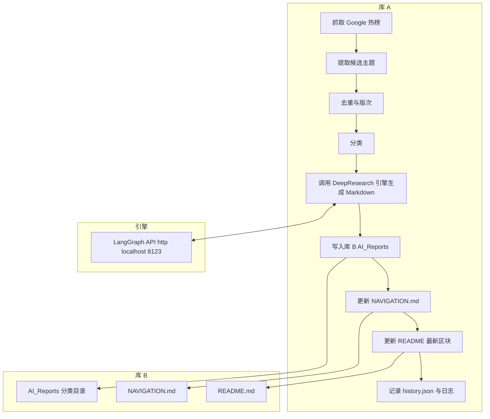

# gemflow3 — 每日 DeepResearch 自动化（库 A → 库 B）+ LangGraph 引擎

本仓库集成了“库 A 编排 + 库 B 内容归档展示 + LangGraph DeepResearch 引擎”一体化方案，实现每日自动抓取热点、生成结构化 Markdown 报告、推送到库 B，并自动更新 NAVIGATION.md 与 README 最新报告区块。

- 编排侧 Library A: Python 工作流，负责抓取→候选生成→分类→调用引擎→落库 B→更新导航与首页→幂等记录
- 引擎侧: 使用 Google Gemini + LangGraph 的研究代理，通过 web 搜索与反思迭代完成深入研究并产出可引用的回答
- 运行形态: GitHub Actions 内部基于 docker-compose 拉起引擎 http://localhost:8123，然后执行库 A 主流程

相关背景文档可见 [Code-Map.md](Code-Map.md)。

---

## 目录结构

- 库 A（编排与自动化）
  - 主流程入口: [repo_a/main_workflow.py](repo_a/main_workflow.py)
  - 依赖清单: [repo_a/requirements.txt](repo_a/requirements.txt)
  - 环境样例: [repo_a/.env.example](repo_a/.env.example)
  - 配置加载: [repo_a/src/config.py](repo_a/src/config.py)
  - 引擎客户端: [repo_a/src/engine_client.py](repo_a/src/engine_client.py)
  - 热榜抓取与缓存: [repo_a/src/trends.py](repo_a/src/trends.py)
  - 主题提取与分类: [repo_a/src/topics.py](repo_a/src/topics.py)
  - 历史与幂等: [repo_a/src/history.py](repo_a/src/history.py)
  - GitHub API 写入: [repo_a/src/github_api.py](repo_a/src/github_api.py)
  - 导航与 README 渲染: [repo_a/src/renderers.py](repo_a/src/renderers.py)
  - 工具函数: [repo_a/src/utils.py](repo_a/src/utils.py)
  - 结构化日志: [repo_a/src/logger.py](repo_a/src/logger.py)
- 引擎（LangGraph + Gemini）
  - 总览与使用: [gemini-fullstack-langgraph-quickstart/README.md](gemini-fullstack-langgraph-quickstart/README.md)
  - 后端图定义: [gemini-fullstack-langgraph-quickstart/backend/src/agent/graph.py](gemini-fullstack-langgraph-quickstart/backend/src/agent/graph.py)
  - FastAPI 前端挂载: [gemini-fullstack-langgraph-quickstart/backend/src/agent/app.py](gemini-fullstack-langgraph-quickstart/backend/src/agent/app.py)
  - 容器构建: [gemini-fullstack-langgraph-quickstart/Dockerfile](gemini-fullstack-langgraph-quickstart/Dockerfile)
  - 运行编排（CI 内部）: [gemini-fullstack-langgraph-quickstart/docker-compose.yml](gemini-fullstack-langgraph-quickstart/docker-compose.yml)
- CI 工作流
  - 每日任务: [.github/workflows/daily-deepresearch.yml](.github/workflows/daily-deepresearch.yml)

---

## 架构与流程



报告命名: {slugified_主题}-{日期}--v{版次}.md  
示例路径: AI_Reports/<分类slug>/ai-ben-di-xiao-mo-xing-you-hua-2025-08-20--v1.md

---

## 快速开始

### 方式 A：本地 dry-run（不推送库 B，仅验证流程）

1) 安装依赖
```bash
pip install -r repo_a/requirements.txt
```

2) 配置环境  
复制 [repo_a/.env.example](repo_a/.env.example) 为 .env 并按需修改。例如:
```
REPO_B=owner/DeepResearch-Archive
API_BASE_URL=http://localhost:8123
TZ=Asia/Shanghai
# 本地 dry-run 可不设置 REPO_B_TOKEN
```

3) 运行（dry-run）
```bash
DRY_RUN=1 python repo_a/main_workflow.py
```

说明: dry-run 会调用引擎生成 Markdown（若 API_BASE_URL 可用），但不推送到库 B。

### 方式 B：CI 内部全自动（推荐）

本仓库已提供每日定时工作流: [.github/workflows/daily-deepresearch.yml](.github/workflows/daily-deepresearch.yml)

- 触发: 北京时间每日 00:00
- 步骤: 构建镜像 → docker-compose 启动 LangGraph API → 探活 http://localhost:8123/openapi.json → 执行 [repo_a/main_workflow.py](repo_a/main_workflow.py) → 更新库 B → 清理

在 GitHub 仓库 gemflow3 的 Settings → Secrets and variables → Actions 中配置以下 Secrets:
- REPO_B_TOKEN: 细粒度 PAT（仅 contents: write）指向库 B
- GEMINI_API_KEY: Google Gemini API 密钥
- LANGSMITH_API_KEY: LangSmith API 密钥（仅用于 docker-compose 示例）

环境变量注入见工作流中的 Run daily workflow 步骤：
- REPO_B: owner/DeepResearch-Archive（如需修改库 B，请同步更新）
- API_BASE_URL: http://localhost:8123
- TZ: Asia/Shanghai

---

## 库 B 期望结构

- README.md
- NAVIGATION.md（由库 A 幂等生成）
- AI_Reports/<分类slug>/<slugified_主题>-<yyyy-mm-dd>--vN.md
- 可选: history.json（元数据索引）

分类集合默认: AI, 安全, 开源, 芯片, 云与大数据, 其他  
可通过环境变量 CATEGORY_LIST 配置；显示名与 slug 分离，slug 化仅用于目录安全。

---

## 配置项

- 必填
  - REPO_B: 目标仓库坐标，如 owner/DeepResearch-Archive
  - API_BASE_URL: DeepResearch 引擎基址，CI 内为 http://localhost:8123
  - TZ: Asia/Shanghai
- 可选
  - REPO_B_TOKEN: 推送库 B 的 PAT（本地 dry-run 可不填）
  - CATEGORY_LIST: 逗号分隔分类集合
  - URL_WHITELIST: 逗号分隔的域名白名单（预留内容安全过滤）
  - MAX_CONCURRENT_TOPICS, HTTP_MAX_RETRIES, HTTP_BACKOFF_SECONDS, MAX_REPORTS_PER_RUN 等运行参数

配置解析与校验逻辑见: [repo_a/src/config.py](repo_a/src/config.py)

---

## 运行机制与幂等

- 指纹: SHA-256(主题归一 + 日期 + 版次)；重复跳过
- 版次: 同日同主题占用 vN，冲突自动递增
- 导航与首页: 扫描文件系统构建索引 → 纯函数渲染 → 空 diff 不提交
- 重试: HTTP 指数退避，详见 [repo_a/src/engine_client.py](repo_a/src/engine_client.py)
- 历史记录: [repo_a/src/history.py](repo_a/src/history.py) 写入 repo_a/state/history.json
- 结构化日志: [repo_a/src/logger.py](repo_a/src/logger.py) 输出到 repo_a/state/logs/YYYY-MM-DD.jsonl

---

## DeepResearch 引擎说明

- 引擎仓库: [gemini-fullstack-langgraph-quickstart/README.md](gemini-fullstack-langgraph-quickstart/README.md)
- 图定义: [gemini-fullstack-langgraph-quickstart/backend/src/agent/graph.py](gemini-fullstack-langgraph-quickstart/backend/src/agent/graph.py)
- Docker 打包后在 CI 中通过 docker-compose 暴露 8123 端口供库 A 调用
- 库 A 调用入口: [repo_a/src/engine_client.py](repo_a/src/engine_client.py) → /graphs/agent/invoke

---

## 推送到 GitHub 的 gemflow3

若需将本地代码推送到你的 GitHub 仓库 gemflow3，可参考以下步骤（HTTPS 示例）：

```bash
# 在当前项目根目录初始化（若尚未）
git init
git add .
git commit -m "feat: initial commit for gemflow3 deepresearch pipeline"

# 关联远端（请替换 <owner> 为你的 GitHub 用户名或组织）
git remote add origin https://github.com/<owner>/gemflow3.git

# 推送
git branch -M main
git push -u origin main
```

你也可以使用 SSH：
```bash
git remote remove origin 2>/dev/null || true
git remote add origin git@github.com:<owner>/gemflow3.git
git push -u origin main
```

推送后，请在 gemflow3 仓库的 Settings → Secrets and variables → Actions 中添加 REPO_B_TOKEN、GEMINI_API_KEY、LANGSMITH_API_KEY，并确保 [.github/workflows/daily-deepresearch.yml](.github/workflows/daily-deepresearch.yml) 中 REPO_B 与你的库 B 坐标一致。

---

## 故障排查

- 引擎未就绪
  - CI 会探测 http://localhost:8123/openapi.json；失败时输出 docker 日志
- 无新增报告
  - 可能当日热榜为空或候选提取无有效主题（可查看日志 repo_a/state/logs/*.jsonl）
- 推送失败
  - 确认 REPO_B_TOKEN 权限仅限 contents: write 且作用于库 B
- 模板不匹配
  - 引擎会遵循 Markdown 模板提示；如需更强约束，可在 [repo_a/src/engine_client.py](repo_a/src/engine_client.py) 中调整提示词

---

## 许可证

- 引擎子项目遵循其原始许可: [gemini-fullstack-langgraph-quickstart/LICENSE](gemini-fullstack-langgraph-quickstart/LICENSE)
- 其余新增代码默认在本仓库许可下分发（如无特别说明）
